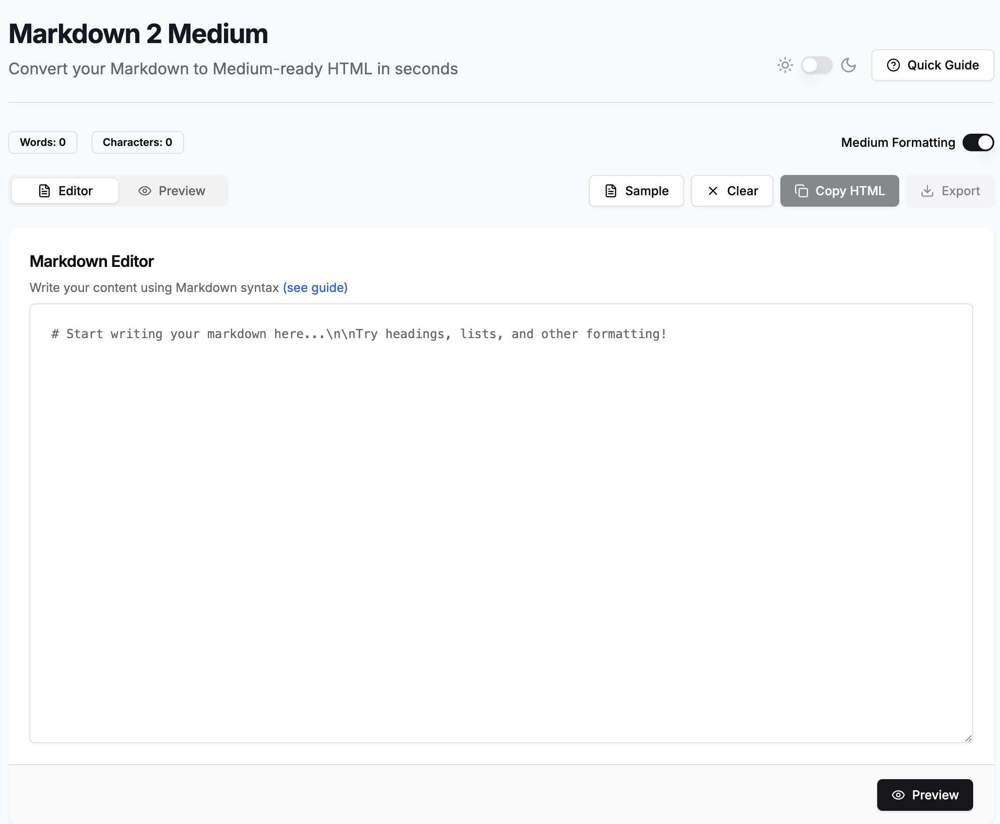

# Markdown2Medium Converter



A powerful tool that converts Markdown to Medium-compatible text. Perfect for writers who want to maintain their workflow in Markdown while publishing to Medium.

## Getting Started 🚀

### Prerequisites

- Node.js (v16 or later)
- npm or yarn

### Installation

1. Clone the repository:

   ```bash
   git clone https://github.com/joel-hanson/markdown-to-medium.git
   ```

2. Navigate to the project directory:

   ```bash
   cd markdown-to-medium
   ```

3. Install dependencies:

   ```bash
   npm install
   # or
   yarn install
   ```

### Running the Application

Start the development server:

```bash
npm run dev
# or
yarn dev
```

Open [http://localhost:3000](http://localhost:3000) in your browser.

## Usage Guide 📝

1. **Write your content** in the Markdown editor
2. **Preview** how it will look on Medium
3. **Copy the content** by dragging the full content from the preview section.
4. **Paste into Medium's editor**

## Deployment 📦

Build for production:

```bash
npm run build
# or
yarn build
```

Deploy to Vercel, Netlify, or your preferred hosting service.

## License 📄

This project is licensed under the MIT License - see the [LICENSE](LICENSE) file for details.

## Acknowledgments 🙏

- Inspired by Medium's publishing workflow
- Built with [Next.js](https://nextjs.org/)
- UI powered by [shadcn/ui](https://ui.shadcn.com/)
- Markdown processing with [marked](https://marked.js.org/)
